# Getting Started with Simble

This project is a dissertation project written by Wankyu Lim (wl39 - 160005106)

## To run the program

- Simply type `npm start` in the terminal.
- The code above will open the web browser.
- Now you can try whatever you want :)

***OR***

- You can directly use the application in this link: https://conjure-cp.constraintmodelling.org/university-timetabling-demo

## User Interface

Below are some screenshots of the project UI:

### Home Page

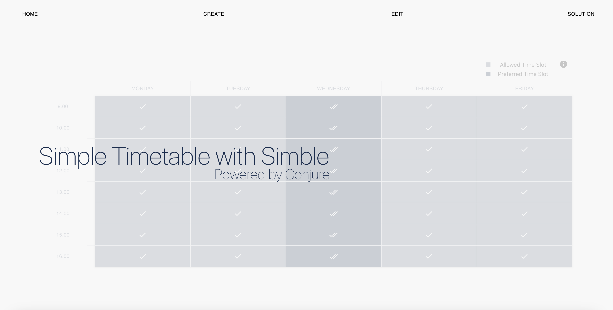

This is the homepage with no existing project

### Create Page

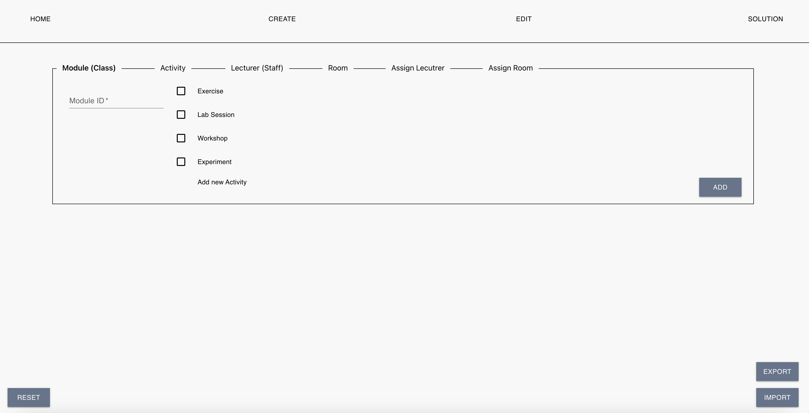

This is the project page showing the project details

### Edit Page

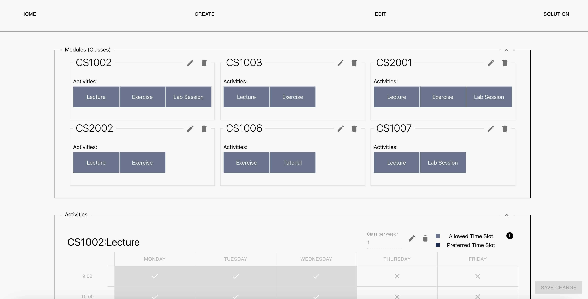

This is the project page showing the project details

### Solution Page

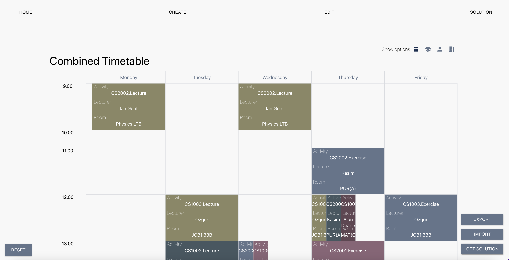

This is the project page showing the project details

## Application Preview

### Simple tutorial with Tutorial.json file

- Download Tutorial.json file
- Go to **CREATE** tab
- Click the **IMPORT** button
  - Import the Tuorial.json file
- Go to **SOLUTION** tab
- Click **GET SOLUTION** button
- Done!

### Import tutorial

Import data from the tutorial.json

### Get solution

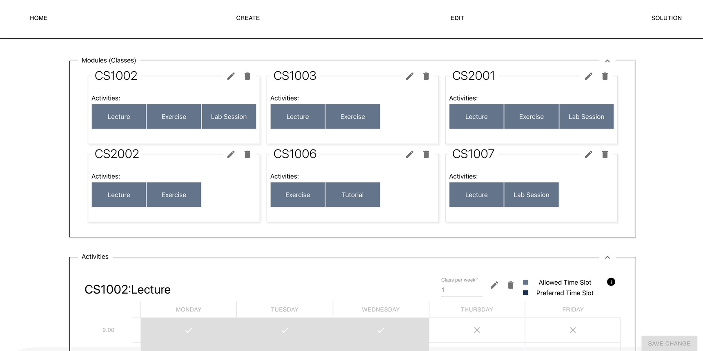

Get timetabling solution for the tutorial example

### Create new module

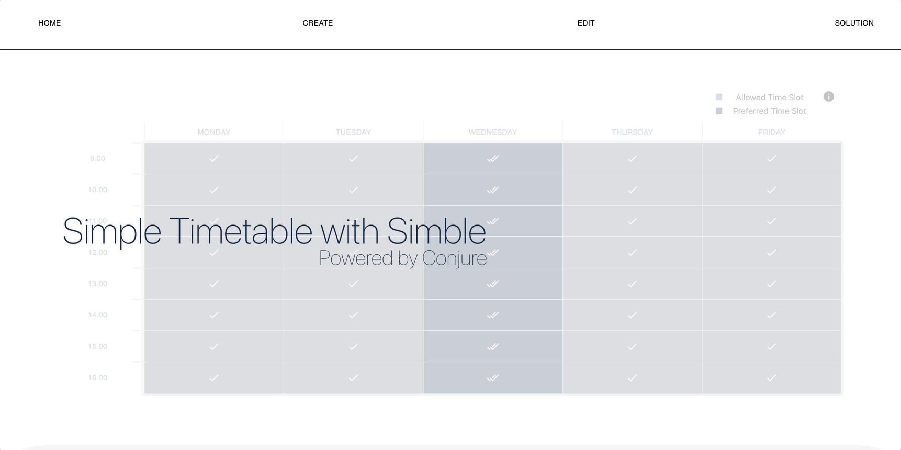

Create a new module named **CS1002**

### Create new activity

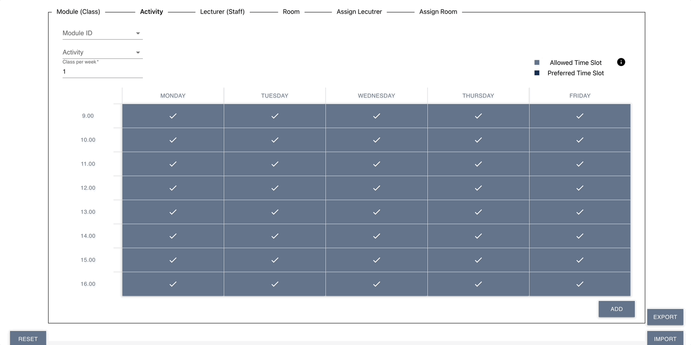

Create **lecture** activity for **CS1002** 

### Create new lecturer

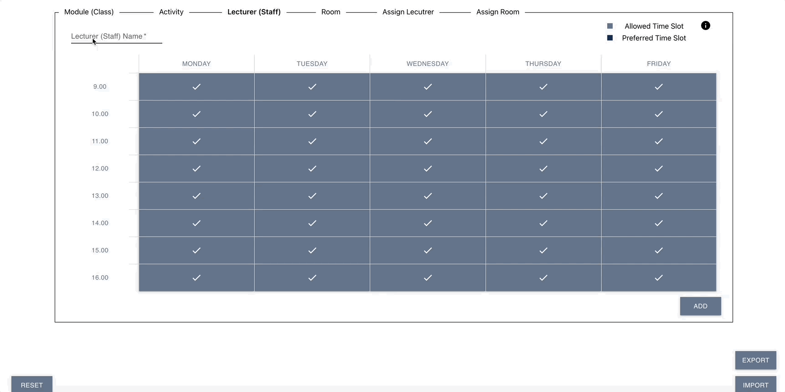

Create lecturer **Ruth Leatham**

### Create new room

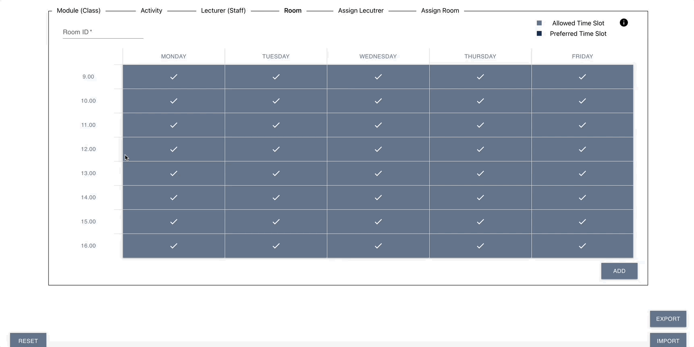

Create room **JH110**

### Assign lecturer

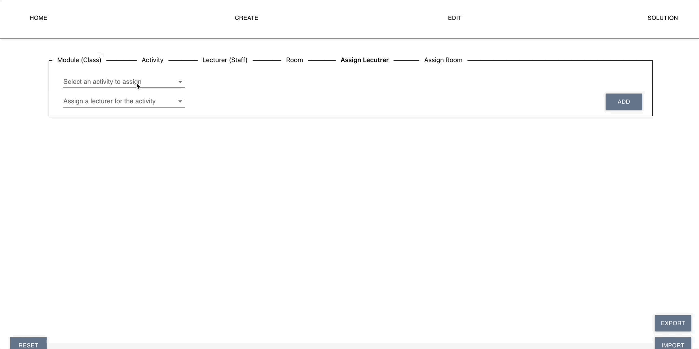

Assign lecturer **Ruth** to **CS1002**

### Assign room

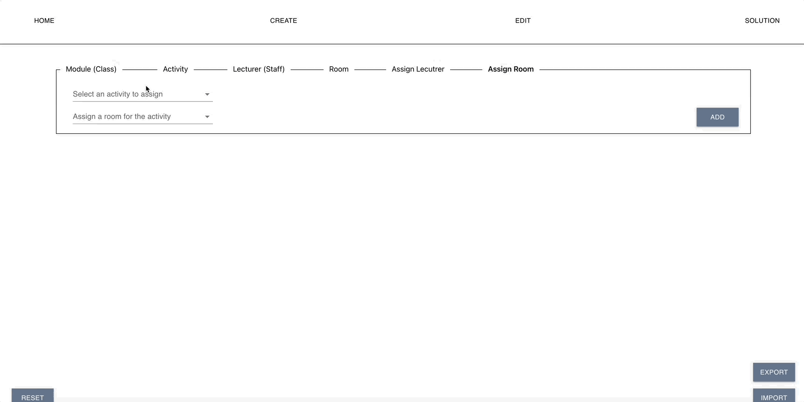

Assign **JH110** to **CS1002**

## Bugs and errors
- If you find and buys or errors please email me(iwg6852@gmail.com), I will try to fix it ASAP.

## License

This project is licensed under the Mozilla Public License 2.0. For full license information, please see the [LICENSE](./LICENSE) file in the repository.
